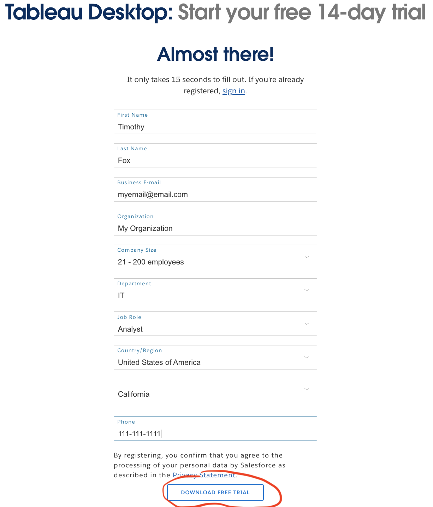

# Installing Trial version of Tableau

## Introduction

This is instructions on how to install the trial version

## Sign up for the trial

Go to [Tableau Desktop Install](http://tableau.com/products/desktop/download). Make sure it actually says "Tableau Desktop" and not Tableau.

Fill out the form as follows, substituting your own name and email:

When you do this you will see the screen shown as follows:

(Note this screrenshot is for a Mac user)

(A Windows screenshot is as follows):

## Located the downloaded executable.

Go to your "Downloads" folder in Windows Explorer (windows), or Finder(Mac).

Once you are there you should notice a file called TableauDesktop:

Double click or select the installer file.

## Run the Installerr

Run the installer as follows. It should look like this:

## Start the Application

Once you are done installing, it should start the application. If not, you can go to your start menu and find Tableau Desktop.

## Fill out your email for the welcome

You shoud be welcomeed to Tableau.

It will ask you to fill your email for the registration. Enter your email.

## Start Tableau again an click "Continue Trial"

Start Tableau again and click Continue Trial.

## Verify your license is a trial license

(This step is optional if you want to verify your license).

Go to Tableau, go to the menu and select Help -> View Product License

## Conclusion

Congradulations, you should have a 15 day trial installed
